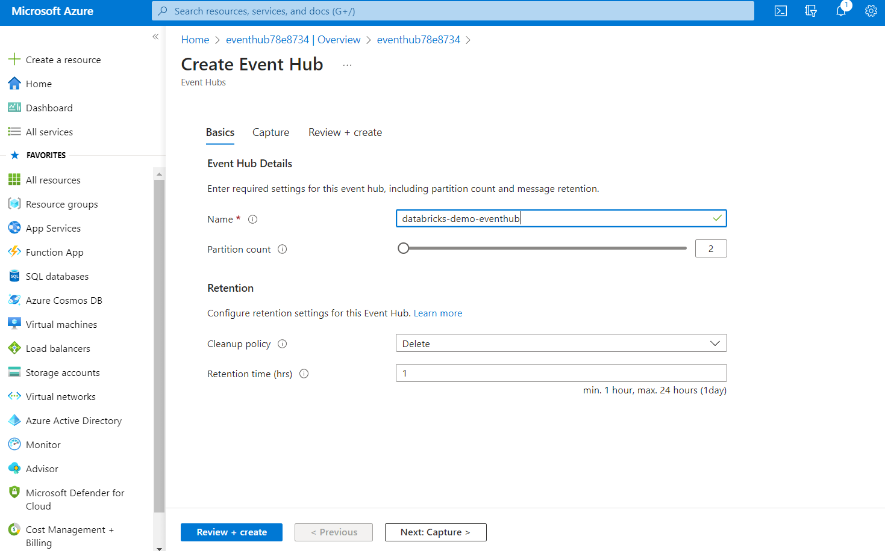

### Create an Event Hubs namespace

1. In the Azure portal, select **+ Create a resource**. Enter event hubs into the Search the Marketplace box, select Event Hubs from the results, and then select **Create**.

   

2. In the Create Namespace pane, enter the following information:

   - **Subscription**: Select the subscription group you're using for this module.
   - **Resource group**: Choose your module resource group.
   - **Namespace name**: Enter a unique name, such as **databricksdemoeventhubs**. Uniqueness will be indicated by a green check mark.
   - **Location**: Select the location you're using for this module.
   - **Pricing tier**: Select **Basic**.

   Select **Review + create**, then select **Create**.

   

### Create an event hub

1. After your Event Hubs namespace is provisioned, browse to it and add a new event hub by selecting the **+ Event Hub** button on the toolbar.

   

2. On the **Create Event Hub** pane, enter:

   - **Name**: Enter `databricks-demo-eventhub`.
   - **Partition Count**: Enter **2**.

   Select **Create**.

   

### Copy the connection string primary key for the shared access policy

1. On the left-hand menu in your Event Hubs namespace, select **Shared access policies** under **Settings**, then select the **RootManageSharedAccessKey** policy.

   

2. Copy the connection string for the primary key by selecting the copy button.

   

3. Save the copied primary key to Notepad.exe or another text editor for later reference.
